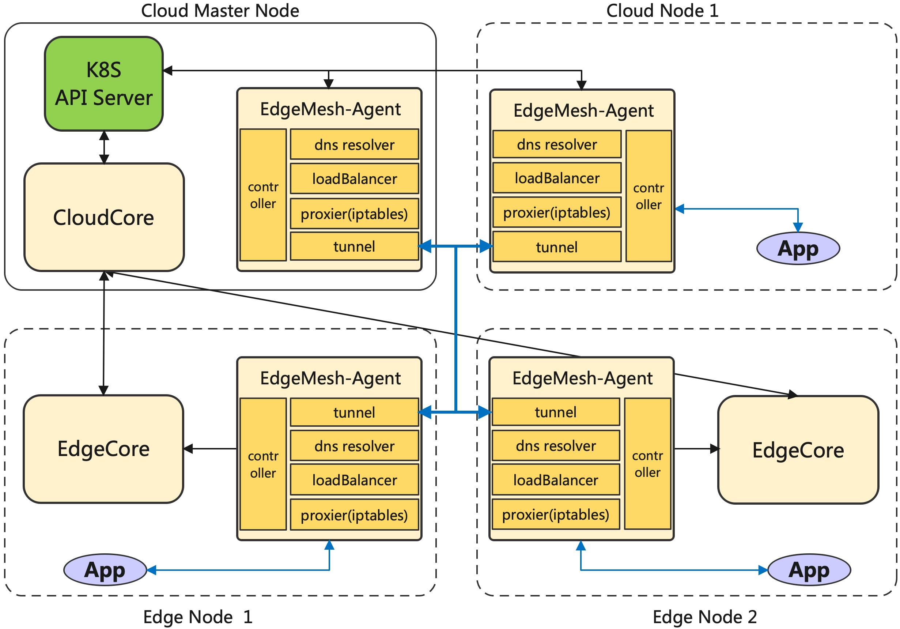

English | [简体中文](./README_zh.md)

# EdgeMesh

## Introduction

EdgeMesh, as the data plane component of the [KubeEdge](https://github.com/kubeedge/kubeedge) cluster, provides simple service discovery and traffic proxy functions for applications, thereby shielding the complex network structure in edge scenarios.

### Background

KubeEdge is build based on [Kubernetes](https://github.com/kubernetes/kubernetes), extending cloud-native containerized application orchestration capabilities to the edge. However, at the scenario of edge computer, the network topology is more complex. Edge nodes in different areas are often not interconnected, and the inter-communication of traffic between applications is the primary requirement of the business. For this scenairo, EdgeMesh offers a solution.

### Why EdgeMesh?

EdgeMesh satisfies the new requirements in edge scenarios (e.g., limited edge resources, unstable edge cloud network, complex network structure, etc.), that is, high availability, high reliability, and extreme lightweight:

- **High availability**
  - Use the capabilities provided by LibP2P to connect the network between edge nodes
  - Divide the communication between edge nodes into intra-LAN and cross-LAN
    - Intra-LAN communication: direct access
    - Cross-LAN communication: when the hole punching is successful, a direct tunnel is established between the agents, otherwise the traffic is forwarded through the relay
- **High reliability (offline scenario)**
  - Metadata is distributed through the KubeEdge edgehub/cloudhub tunnel, no need to access the cloud apiserver
  - EdgeMesh integrates a lightweight node-level DNS server, service discovery no longer accesses the cloud CoreDNS
- **Extreme lightweight**
  - Each node has one and only one Agent, which saves edge resources

**User value**

- Enable users to have the ability to access edge-to-edge/edge-to-cloud/cloud-to-edge applications across different LANs
- Compared to the mechanism of CoreDNS + Kube-Proxy + CNI service discovery, users only need to simply deploy an Agent to finish their goals

### Key Features

<table align="center">
  <tr>
    <th align="center">Feature</th>
    <th align="center">Sub-Feature</th>
    <th align="center">Realization Degree</th>
  </tr>
  <tr>
    <td align="center">Service Discovery</td>
    <td align="center">/</td>
    <td align="center">✓</td>
  </tr>
  <tr>
    <td rowspan="5" align="center">Traffic Governance</td>
    <td align="center">HTTP</td>
    <td align="center">✓</td>
  </tr>
  <tr>
    <td align="center">TCP</td>
    <td align="center">✓</td>
  </tr>
  <tr>
    <td align="center">Websocket</td>
    <td align="center">✓</td>
  </tr>
  <tr>
    <td align="center">HTTPS</td>
    <td align="center">✓</td>
  </tr>
  <tr>
    <td align="center">UDP</td>
    <td align="center">✓</td>
  </tr>
  <tr>
    <td rowspan="3" align="center">Load Balance</td>
    <td align="center">Random</td>
    <td align="center">✓</td>
  </tr>
  <tr>
    <td align="center">Round Robin</td>
    <td align="center">✓</td>
  </tr>
  <tr>
    <td align="center">Session Persistence</td>
    <td align="center">✓</td>
  </tr>
  <tr>
    <td rowspan="2" align="center">Edge Gateway</td>
    <td align="center">External Access</td>
    <td align="center">✓</td>
  </tr>
  <tr>
    <td align="center">Multi-NIC Monitoring</td>
    <td align="center">✓</td>
  </tr>
  <tr>
    <td rowspan="2" align="center">Cross-Subnet Communication</td>
    <td align="center">Cross-Cloud Communication</td>
    <td align="center">✓</td>
  </tr>
  <tr>
    <td align="center">Cross-LAN E2E Communication</td>
    <td align="center">✓</td>
  </tr>
  <tr>
    <td align="center">Edge CNI</td>
    <td align="center">Cross-Subnet Pod Communication</td>
    <td align="center">+</td>
  </tr>
</table>

**Noting:**

- `✓` Features supported by the EdgeMesh version
- `+` Features not available in the EdgeMesh version, but will be supported in subsequent versions
- `-` Features not available in the EdgeMesh version, or deprecated features

## Architecture

> After EdgeMesh v1.12.0, the capabilities of edgemesh-server are merged into the tunnel module of edgemesh-agent, so that edgemesh-agent with relay capability can automatically become a relay server, providing other nodes with the functions of assisting hole punching and relaying

The core components of edgemesh-agent include:

- **Proxier**: Responsible for configuring the kernel's iptables rules, and intercepting requests to the EdgeMesh process
- **DNS**: Built-in DNS resolver, which resolves the DNS request in the node into a service cluster IP
- **LoadBalancer**: Load balancer, which forwards requests to corresponding backend instances through rich load balancing strategies
- **Controller**: Obtains metadata (e.g., Service, Endpoints, Pod, etc.) by accessing the apiserver of Kubernetes or KubeEdge
- **Tunnel**: Based on LibP2P implementation, using automatic relay, MDNS and hole punching to provide the ability to communicate across subnets

## Guides

### Documents
Documentation is located on [edgemesh.netlify.app](https://edgemesh.netlify.app/). These documents can help you understand EdgeMesh better.

### Installation
Follow the [EdgeMesh installation document](https://edgemesh.netlify.app/) to install EdgeMesh.

### Examples
Example1: [HTTP traffic forwarding](https://edgemesh.netlify.app/guide/test-case.html#http)

Example2: [HTTPS traffic forwarding](https://edgemesh.netlify.app/guide/test-case.html#https)

Example3: [TCP traffic forwarding](https://edgemesh.netlify.app/guide/test-case.html#tcp)

Example4: [Websocket traffic forwarding](https://edgemesh.netlify.app/guide/test-case.html#websocket)

Example5: [UDP traffic forwarding](https://edgemesh.netlify.app/guide/test-case.html#udp)

Example6: [Load Balance](https://edgemesh.netlify.app/guide/test-case.html#load-balance)

Example7: [Cross-edge-cloud communication](https://edgemesh.netlify.app/guide/test-case.html#cross-edge-cloud)

## Release

EdgeMesh is currently released with KubeEdge's main repo, and the released products will be placed in [KubeEdge Releases](https://github.com/kubeedge/kubeedge/releases). EdgeMesh's version release cadence will follow and be consistent with https://github.com/kubeedge/kubeedge.

## Contact

If you need support, start with the 'Operation Guidance', and then follow the process that we've outlined

If you have any question, please contact us through the recommended information on [KubeEdge](https://github.com/kubeedge/kubeedge#contact)

## Contributing
If you are interested in EdgeMesh and would like to contribute to EdgeMesh project, please refer to [CONTRIBUTING](./CONTRIBUTING.md) for detailed contribution process guide.
